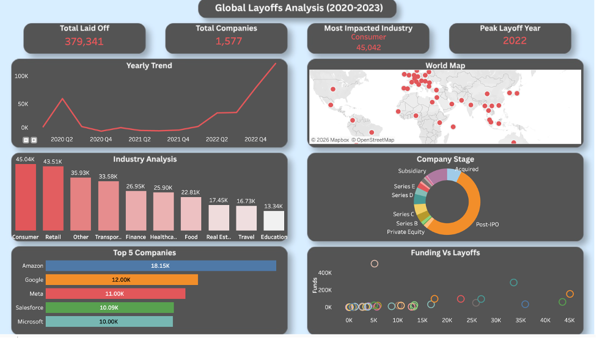

# 📉 Global Layoffs Data Analysis (2020–2023)

An end-to-end Data Analytics project focused on uncovering trends and impacts of the global layoff crisis. This project involves **Data Cleaning & Transformation in MySQL**, deep **Exploratory Data Analysis (EDA)**, and an interactive **Tableau Dashboard** designed with a custom **Canva UI** to visualize workforce reductions across the globe.


<p align="center">
  
</p>

---

## 🎯 Project Objectives

The primary goal is to analyze the layoff landscape to provide data-driven insights for stakeholders by:
* **Identifying Trends:** Tracking how layoffs peaked from the 2020 pandemic through the 2023 economic shift.
* **Industry Impact:** Pinpointing which sectors (Retail, Tech, Consumer) were hit the hardest.
* **Company Analysis:** Evaluating the performance and survival of companies based on their growth stage (Post-IPO, Series B, etc.).
* **Funding Correlation:** Investigating if high funding levels actually prevented or contributed to mass layoffs.
* **Interactive Visualization:** Building a high-end dashboard to make complex layoff data easy to digest.

---

## 🧠 Dataset Overview

The dataset covers global layoff events recorded between **2020 and 2023**.
* **Key Features:** Company Name, Location, Industry, Total Laid Off, Percentage, Date, Stage, and Funds Raised (Millions).
* **Data Quality:** Cleaned and standardized using SQL to ensure accurate time-series and categorical analysis.

---

## 🛠️ Tools & Technologies

* **Database:** MySQL Workbench (Primary tool for Data Cleaning, Transformation, and EDA).
* **Visualization:** Tableau Desktop (For interactive storytelling and dashboarding).
* **UI/UX Design:** Canva (Used for creating the custom dashboard background and layout).

---

## 🧹 Data Preparation & Engineering (MySQL)

All data preprocessing was performed using SQL to maintain database integrity:
1. **Data Cleaning:** Removed duplicates using **CTE** and `ROW_NUMBER()` and handled null values in critical columns.
2. **Standardization:** Standardized industry names and fixed inconsistent company entries.
3. **Date Conversion:** Transformed text-based date strings into proper **DATE** formats for accurate yearly and monthly trend analysis.
4. **Advanced Analysis:** Built complex queries to calculate **rolling totals** and rank company layoffs globally.

---

## 📊 Interactive Dashboard (Tableau)

The dashboard was built with a custom UI/UX design to provide a premium analytical experience. Key visualizations include:
* **KPI Overview:** Total Layoffs, Total Companies, and Peak Layoff Year.
* **Yearly Trend:** A continuous line chart showing the growth of the crisis.
* **Industry Analysis:** Bar charts highlighting the most impacted sectors like Retail and Consumer.
* **Company Stage:** A donut chart showing layoffs by business lifecycle (e.g., Post-IPO).
* **Funding Scatter Plot:** Exploring the correlation between funds raised and layoffs.

> 🔗 **View Live Dashboard:** [Link to Tableau Public](https://public.tableau.com/app/profile/mehedi.hasan2176/viz/GlobalLayoffsAnalysis2020-2023_17763302949010/Dashboard1)

---

## 📈 Key Insights

* ⚠️ **The Absolute Peak:** Layoffs reached an unprecedented high in late 2022 and early 2023.
* 🏢 **Sector Risks:** The Retail and Consumer industries faced the highest volume of job losses.
* 💰 **The Funding Paradox:** High funding did not guarantee stability; many "well-funded" companies executed the largest layoffs.
* 📈 **Growth Stage:** Post-IPO companies contributed the most to the total number of global layoffs.
* 🌍 **Global Impact:** Large tech hubs recorded significantly higher numbers compared to emerging markets.

---

## 📂 Project Structure
```text
LAYOFFS/
├── image/
│   └── layoffs_dashboard.png           # Dashboard screenshot
├── cleaning_layoffs.sql                # SQL script for data cleaning
├── layoffs_analysis.sql                # SQL script for EDA and analysis
├── layoffs_final_clean.csv             # Final cleaned dataset
├── layoffs.csv                         # Raw dataset
├── Global-Layoffs-Analysis-2020-2023.pdf # Analysis report
├── Project Report on Layoffs.pdf        # Detailed project documentation
└── README.md                           # Project summary and documentation
```

---

## 📌 Strategic Recommendations

1. **Sustainable Growth:** Companies should prioritize cost-efficiency over aggressive expansion fueled solely by temporary funding.
2. **Skill Diversification:** Workers in volatile industries should be encouraged to upskill in more stable sectors.
3. **Proactive Monitoring:** Businesses should use data dashboards to monitor economic cycles and prepare for downturns.
4. **Burn Rate Management:** Late-stage companies need better "burn rate" management to protect their workforce during market shifts.

---

## 👤 Author
**Mehedi Hasan**
* 🔗 LinkedIn: [https://www.linkedin.com/in/mehedi-hasan-094855388/](https://www.linkedin.com/in/mehedi-hasan-094855388/)
* 🔗 Kaggle: [https://www.kaggle.com/mehedi71](https://www.kaggle.com/mehedi71)
* 🔗 Tableau Public: [https://public.tableau.com/app/profile/mehedi.hasan2176](https://public.tableau.com/app/profile/mehedi.hasan2176)
